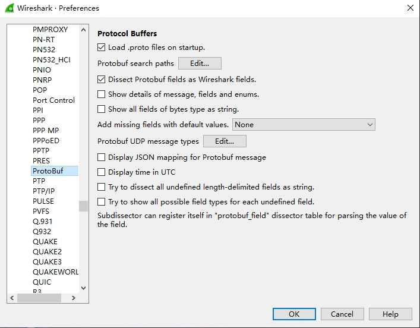
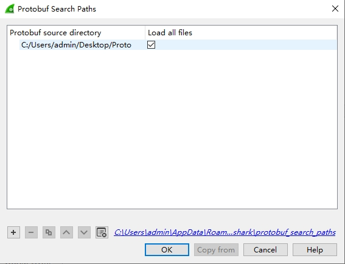
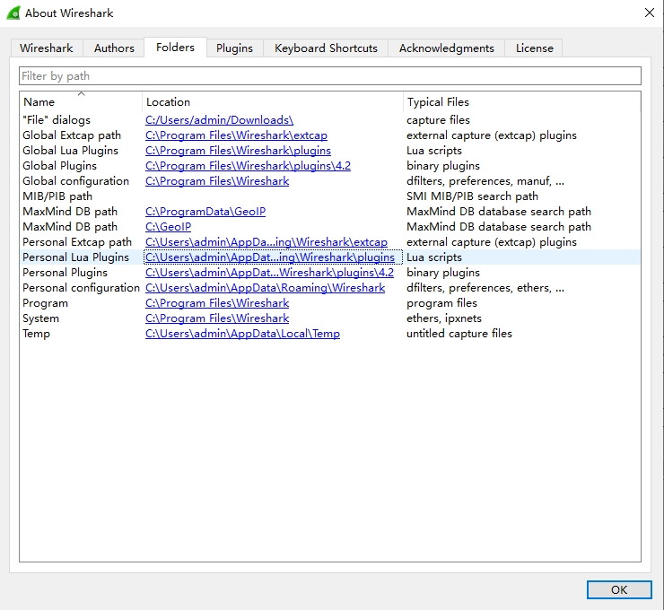
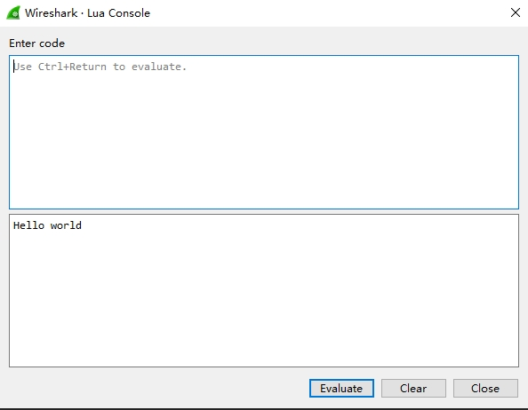
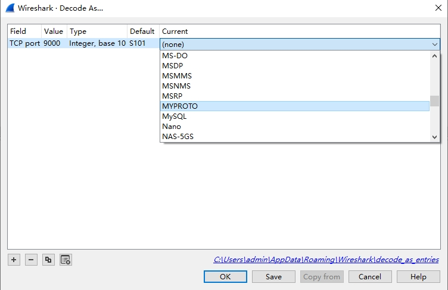

# Wireshark Protobuf Lua-dissector

Been trying to use Wireshark to capture network packet flow and decode the packets with Protobuf protocol through TCP connection. Googled but nothing readlly detailed enough to help me get it done within an hour. So I put down this guide for future references and hope it can save some of your time.

This guide will assume you have basic knowledge of Wireshark and if not, feel free to google it! It is suprisingly simple and capable tool. We will strictly stick to Wireshark and Protobuf here.

## Step 1: Get Wireshark

Download Wireshark from the [official website](https://www.wireshark.org/).

## Step 2: Set Up WireShark Protobuf

### Add Protobuf path

Tell Wireshark where to look for your *.proto files. I simply put all my *.proto files in a single directory and add that path to it.

In Wireshark version 4.2.3, you can set up the proto path this way:

**Edit -> Preferences** to open the Preferences window; 

On the left side of the window, expand the **Protocols** tag and look for **Protobuf** and you will have a window looks exactly like mine:




Then click **Edit** button right next to the "Protobuf search paths" to open up another window:



As you can see, I put all my protobuf files in a single folder on my desktop. You can just add whatever directories you need Wireshark searching. If your proto files have external proto files dependancies, you can simple add multiple paths to it as you can see in the [official tutorial](https://gitlab.com/wireshark/wireshark/-/wikis/Protobuf).

## Step 3 Run and debug Lua script

### 1. Add Lua script

Now, we need to add our own Lua dissector script so that we can customize our own Protobuf dissectors.

Click **Help -> About Wireshark** to open up the about window: 



Under **Folder** tag, double click to open up **Personal Lua Plugins** folder and create your own Lua script. Name it whatever you like and Wireshark will load and run it. Your can type up a simple `print("Hello world")` *.lua file and we will now learn how to run and debug our Lua file next.

### 2. Run and debug

Once you add your Lua script, Wireshark will run it every time it starts up. You can open up the Lua console to see if it runs properly and print out "Hello world" for you.

To open up the Lua console, simple click **Tools -> Lua Console** 



The upper box is for you to write Lua code on the go which we will not utilize in this guide. Yet the lower box will print out anything our Lua scripts print.

We wouldn't want to restart Wireshark everytime we modify our Lua scripts, then you can Reload your Lua scripts by Clicking **Analysis -> Reload Lua Plugins** or simple use the keyboard shortcut **Ctrl+Shift+L** on Windows. I don't have a mac so, I am guiessing **CMD+Shift+L**?

Be mindful that by reloading Lua scripts, Wireshark will re-run the scripts on every captured packets so it may take a while if you have already captured tons of packets.

## Step 4: Writing Lua :)

Now that everything is ready, you just need to write your own Lua protobuf dissector for Wireshark! 

Thanks to Wireshark, they do have documentation for Lua APIs [here](https://www.wireshark.org/docs/wsdg_html_chunked/wsluarm_modules.html). 

After reading two great tutorials [this](https://wiki.wireshark.org/Protobuf) and [that](https://tewarid.github.io/2010/09/27/create-a-wireshark-dissector-in-lua.html), I strip out some unnecessary codes and will guide you to write a WireShark Protobuf Lua dissector as simple as possible. But it might be over simplified that you may want to checkout the above tutorials for more complex coding.

``` lua
--get an existed protobuf dissector writen by Wireshark
local protobuf_dissector = Dissector.get("protobuf");

--Proto class can be used as a dissector of Protobuf
--but in my case, I simply used it as a dummy to register preferences
--when I actually need to dissect protobuf data, I call the above dissector
--@param myProto name to be displayed
--@param "My Proto" desc
local my_proto = Proto("MyProto", "My Proto");

---define a callback function Wireshark will call upon each packet
---@param tvb table a special class to handle the binary buffer object
---@param pinfo table an object to store packet info
---@param tree table display hierarchy tree on Wireshark GUI
-- The TCP dissector will parse tvb as format:
-- [Header][Message Data]
-- Header: [2 bytes length]
my_proto.dissector = function(tvb, pinfo, tree)
    if tvb:captured_len() == 0 then return end;
    if pinfo.port_type == 2 then --TCP
        pinfo.columns.columns.protocol:set(my_proto.name);
        --create a sub-node as a root to display my own proto data
        local subtree = tree:add(my_proto, tvb());
        local offset = 0;
        local length = tvb(0, 2):le_uint(); --[2 bytes length]
        local data_len = length - 2; --calculate the actual data length for later use
        offset = offset + 2;
        --critical: setting this field tells the dissector which proto message to use against it
        pinfo.private["pb_msg_type"] = "message,myProto.Message";
        pcall(Dissector.call, protobuf_dissector, tvb(offset, data_len), pinfo, subtree);
    end
end

-- register my_proto object to WireShark tcp port
-- if you already know your port, you can put it down
-- else you can just put down 0
-- you can later register the port to this dissector int the "Decode As" menu
DissectorTable.get("tcp.port"):add(0, my_proto);
```

## Step 5(Optional): Decode As 

Once you are done with your code, you can manually assign it through Wireshark GUI in the **Decode As** menu.

**Analyze -> Decode As**



You can add a new item to the menu, select TCP port and type in your actual port number. And if your lua code works out fine, your should see your dissector name in full capital under **Current** dropdown menu.

Then click save, and woa la~

PS：if your code is right but still can't find your dissector, try to do a Reload your lua plugins. 