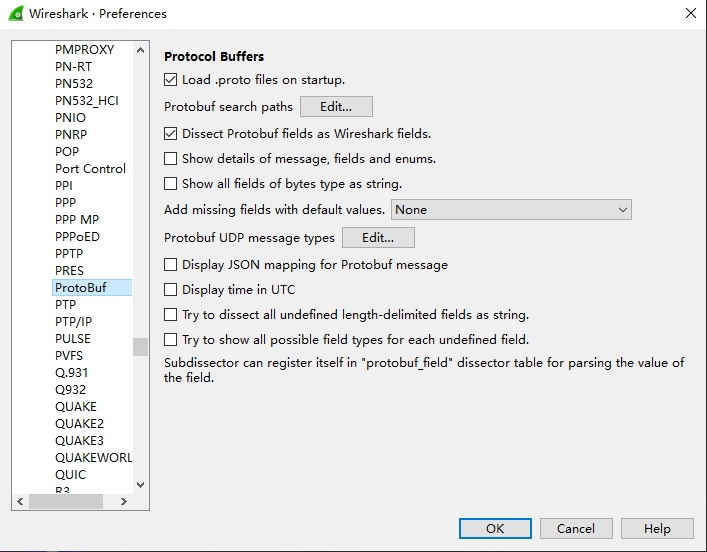
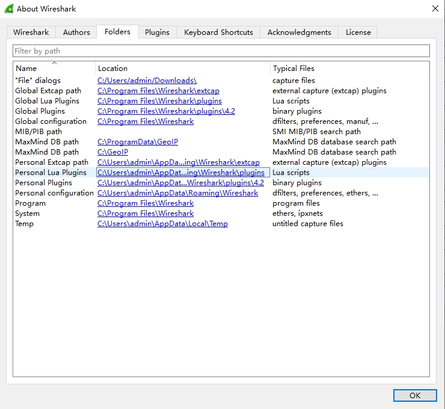

# Wireshark Protobuf Lua-dissector

最近工作中遇到需要Wireshark抓包排查项目网络库的问题，并且需要用ProtoBuf协议解析抓到的二进制数据。网络上查了一圈都没有找到简单明了的教程能让我快速上手的，就搞了这个教程，帮自己纪录的同时也希望能帮到遇到同样问题的你。

这个教程专注于帮你写Lua插件帮你解析Wireshark中的ProtoBuf包，请确保已经掌握基础的Wireshark使用方法。如果还没掌握，网上有很多教学，很快就可以上手了！
## Step 1: 获取 Wireshark

直接从 [官网](https://www.wireshark.org/) 下载。

## Step 2: 配置ProtoBuf相关设置

### 添加ProtoBuf查找路径

顾名思义，告诉Wireshark去哪里查询你的.proto文件。我把我的所有(其实就一个).proto文件都放到了同一个文件夹里，然后添加到Wireshark里即可。

在版本 4.2.3中, 你可以通过一下方法配置ProtoBuf查找路径:

**Edit -> Preferences**，接着在左侧菜单中找到并展开**Protocols**标签，然后找到**Protobuf**并打开对应页面，就会得到以下的界面：



然后点击 "Protobuf search paths" 旁边的**Edit**按钮打开新窗口：


我把所有.proto文件都放一起了，也没有其他外部引用，所以我只添加了一个文件夹路径就OK啦。

## Step 3 运行和调试Lua代码

### 1. 添加Lua脚本

创建并将我们自己写的Lua脚本放到指定文件夹中，Wireshark才能识别到我们的Lua脚本：

 **Help -> About Wireshark** 



点击**Folder**页签，双击**Personal Lua Plugins**路径打开文件夹，并将我们写好的脚本放入其中。

为了测试方便，我们现在只需要写一行简单的打印即可:
```lua
print("Hello World")
```

### 2. 运行和调试

成功将Lua脚本放到对应文件夹后，Wireshark会在每次启动的时候都运行一下你的脚本。你可以打开Lua控制台窗口看看脚本运行的结果。

打开控制台很简单，点击 **Tools -> Lua Console**： 


上半部分的文本输入框是可以实时输入并且运行的Lua代码，我们这里用不到先不管它。重点放在下半部的输出窗口，可以看到我们脚本运行的结果已经打印出来了。

不过我们不希望每次改了代码还要重新运行Wireshark怎么办呢？Wireshark提供了重载Lua脚本的功能，可以在 **Analysis -> Reload Lua Plugins** 中找到，或者直接点击快捷键 **Ctrl+Shift+L**。

需要注意的是，重载Lua脚本之后，Wireshark会在已经捕获的每个包上重新跑一遍我们的Lua脚本。如果你此时已经捕获了大量的包，那么重载可能会消耗不少的时间。

## Step 4: 写Lua Dissector代码 :)

到这步为止，所有的配置都已经完成，只需用Lua实现我们的ProtoBuf Dissector即可。

在我们写之前还有一些很有用的参考资料：

1. Wireshark有Lua APIs的文档在[这里](https://www.wireshark.org/docs/wsdg_html_chunked/wsluarm_modules.html)。

2. 还有两个很好的简单教程在[这里](https://wiki.wireshark.org/Protobuf)和[那里](https://tewarid.github.io/2010/09/27/create-a-wireshark-dissector-in-lua.html)。

以下的代码示例是在我综合了上面的内容之后，摘掉非必要的代码而实现的一个极简的Lua Dissector。不过也存在过于精简而不符合实际运用的需要，这个就需要使用者根据自己的实际需求和协议设计去修改代码了。

``` lua
--获取Wireshark库里现成的ProtoBuf解析器
local protobuf_dissector = Dissector.get("protobuf");

--Proto类可以拿来实现自己的解析器
--不过我这里只用来帮我注册上Wireshark的回调
--然后需要实际解析ProtoBuf的时候，我会调用上面获取到的官方解析器
--@param myProto 名字
--@param "My Proto" 描述
local my_proto = Proto("MyProto", "My Proto");

---Wireshark会在每个包上调用这个预设函数
---@param tvb table 一个辅助操作读取到的二进制流的类对象
---@param pinfo table 储存了包体信息的类对象
---@param tree table GUI上展示信息用的根节点
-- 我的数据流会截取到的数据格式如下：（因项目而异）
-- [Header][Message Data]
-- Header: [2 bytes length]
my_proto.dissector = function(tvb, pinfo, tree)
    if tvb:captured_len() == 0 then return end;
    if pinfo.port_type == 2 then --TCP
        pinfo.columns.columns.protocol:set(my_proto.name);
        --创建一个新的UI节点来展示我们ProtoBuf解析的数据，当然也可以不创建新节点，直接展示在tree上
        local subtree = tree:add(my_proto, tvb());
        local offset = 0;
        local length = tvb(0, 2):le_uint(); --[2 bytes length]
        local data_len = length - 2; --计算实际的数据长度
        offset = offset + 2;
        --这行很关键，官方的解析器会根据这个字段去.proto文件里找对应的协议去解析
        pinfo.private["pb_msg_type"] = "message,myProto.Message";
        pcall(Dissector.call, protobuf_dissector, tvb(offset, data_len), pinfo, subtree);
    end
end

--将我的Proto类对象注册到TCP端口上
--要注意的是，当你还不清楚实际发生的端口号时，先填0，后续再配置即可（具体配置方法看下一部分"Decode As"）
DissectorTable.get("tcp.port"):add(0, my_proto);
```

## Step 5(Optional): Decode As 

当你需要动态调整Tcp端口时，可以在以下的菜单中手动配置：

**Analyze -> Decode As**


点击"+"号添加新的一行，字段选"TCP port"然后填入实际端口号，最后在**Current**下拉框中，找到我们刚刚添加的"MYPROTO"解析器后单击选择。

最后点击保存就配置完成啦！

PS：如果你的代码无误，又看不到你的解析器，请检查一下你是不是没有重载Lua代码。

